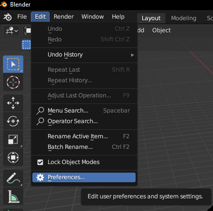

# Modifier name

[TOC]

---

## Overview
Explain what the modifier does

## Parameters

picture of parameters with default values here

## Tips & Use Cases

Formatting stuff: 

!!!tip "Import Method"
    At the top of the Asset Library editor window, there is a drop-down menu set to 'Follow Preferences', which is 'Append (Reuse Data)' by default. This will make Blender create a copy of the modifier in your file as opposed to directly using the modifier within the library. By setting this to 'Link' in either your Preferences window or in the Library Editor window, you can make sure that the imported modifiers respect any changes you may make to the modifiers, or updates to the files in the library folder

## Bigger Bold Letters for Subtitle

### Big Bold Letters for Sub-subtitle

**Bold text** 

*Italicized text*

!!!tip "Tip box title"
    [Hyperlink text](getting_started.md#getting-started)

!!!warning "Tip box title"
    [Hyperlink text](getting_started.md#getting-started)

!!!danger "Tip box title"
    [Hyperlink text](getting_started.md#getting-started)

* Bullet point 1
* Bullet point 2
* Bullet point 3
___
* a
___
> b
___

>Indented text