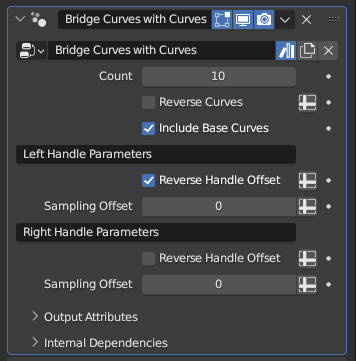

# Bridge Curves with Subcurves

[TOC]

---

## Overview
This modifier generates a sequence of new subcurves along the existing curves, following the normal direction of the existing
curves and running perpendicular to them.

---

## Parameters

* **Count:** Determines how many curves will be created to bridge the curves. While set to zero, uses the evaluated resolution of the curve
with the most control points to determine curve count instead

!!!tip "Evaluated Resolution"
    Because curve resolution also controls the smoothness of the main curves, there being too drastic of a difference between the curve with most control points and the curve with least control points can cause weird interpolation. It is recommended that you use a fixed value instead unless you require the curve count to be dynamic for it to work well with other modifiers

* **Reverse Curves:** Switches where the tip and the roots of the subcurves are placed
* **Include Base Curves:** While enabled, the main curves that are used to generate the subcurves are preserved rather than deleted

!!!warning "Bézier Curve Shapes"
    This modifier generates Bézier curves and orients them by placing their control point handles along the main curves' normals. These following parameter categories work identically, but affect the opposite handles. It is highly recommended that you familiarize yourself with how Bézier curves work and how handle positioning factors into their shapes before you start adjusting the following parameters

* **Reverse Handle Offset:** By default, the handles are offset in the same direction as the curve normal, with the offset scale determined by the main curve radius. Toggling this parameter on reverses the offset direction, offsetting the handle in the opposite direction of the curve normal
* **Sampling Offset:** The normals for the handle offsetting are sampled from the curve the subcurve points are placed on. This value makes the subcurves sample a curve that is further along (or before) the subcurve chain, allowing for more complicated shaping.

---

## Tips & Use Cases

* The order in which curves are bridged is dependent on the curve indices. Typically, the 'oldest' curve in a curve object has the lowest index, with the most recently generated one having the highest index. Deleting curves will never break the ordering, but adding in a new curve will always add it to the end of the order. If you wish to add in a new curve to the middle of the bridge order, you may select all curves after the curve you wish to add in a new curve after, **Separate** (default: P in Edit mode) them to a new curve object, add in your new curve, and then **Join** (default: ctrl+J in Object mode) the two curve objects back together.
