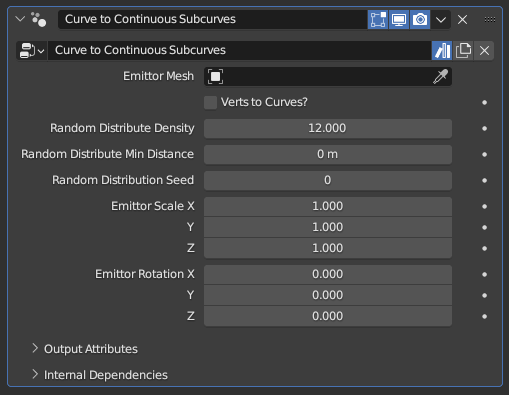

#  Curves to Continuous Subcurves

[TOC]

---

## Overview
This modifier generates subcurves that follow the same overall direction of existing curves, with their distribution and spacing based on an emittor surface.

This modifier works in a similar way to [**Curves to Subcurves**](curve_to_subcurves.md), but the end result prioritizes the continuity of each individual curve as opposed to maintaining the overall volume

<iframe width="560" height="315" src="https://www.youtube.com/embed/eIT8B9RSCfc?si=cz8zGhQhDt2sLL28" title="YouTube video player" frameborder="0" allow="accelerometer; autoplay; clipboard-write; encrypted-media; gyroscope; picture-in-picture; web-share" allowfullscreen></iframe>

---

## Parameters

* **Emittor Mesh:** The mesh object used to generate the subcurves, which controls the overall shape the generated curves will create.
* **Verts to Curves?:** By default, the generated curves have random spacing and density. When this option is enabled, every vertex of the **Emittor Mesh** will instead form a curve.
!!!tip "Practice!"
    This modifier may seem complicated on paper, but in practice it is very straightforward. Do not let the technical descriptions scare you, with a little bit of experimentation it should be very easy to understand

* **Random Distribution Density:** Controls how many subcurves will be generated per curve while **Verts to Curves?** is toggled off. This is an abstract number that controls overall density; setting it to 12 doesn't mean there will be 12 subcurves per curve
* **Random Distribution Min Distance:** Does nothing while set to 0 m. Higher values will delete curves that are within a certain distance to other curves, decreasing the total curve count and evening out the curve distribution.
!!!warning "Relativity of Min Distance"
    This parameter's effect may seem abstract or inconsistent, since its effect is relative to the geometry of the **Emittor Mesh** rather than the radii of the existing curves used to generate the subcurves. Two different curves with the exact same **Random Distribution Density** and **Random Distribute Min Distance** parameters can have wildly different subcurve distribution and counts based on the used **Emittor Mesh** obects

* **Random Distribution Seed:** Seed used for the random distribution. Change it if the end result seems off despite every parameter being set to appropriate values, and the end result will change arbitrarily
* **Emittor Scale X/Y/Z:** Scale value applied to the **Emittor Mesh** object before subcurves are generated from it
* **Emittor Rotation X/Y/Z:** Euler rotation applied to the **Emittor Mesh** object before subcurves are generated from it

---

## Tips & Use Cases

* Using this modifier with **Verts to Curves?** enabled and pairing it with [**Bridge Curves with Mesh**](../mesh_generation/bridge_curves_with_mesh.md) can provide an alternate to [**Curve to Mesh**](../mesh_generation/curve_to_mesh.md) that has a smoother surface with more coplanar faces as long as the tilt parameter of the main curve does not have a significant variance
