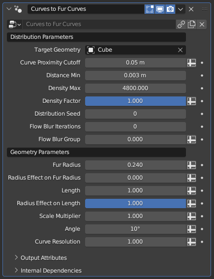

# Curves to Fur Curves

[TOC]

---

## Overview
This modifier generates subcurves that are emitted from a target mesh. The generated fur curves follow the overall direction of the existing control curves, with their angle based on the control curve tilt. Using the modifier parameters, control curve radius can be used to control the fur curve length or radii.

---

## Parameters

* **Target Geometry:** Mesh object to emit the fur curves from. These curves will inherit any attribute the mesh has at the exact root of the curves, which will then be inherited by the mesh if these curves are used for [Curve to Mesh](../mesh_generation/curve_to_mesh.md)
* **Curve Proximity Cutoff:** Determines the maximum distance the fur curves will be generated from the control curves. Increasing it will let you control larger patches for fur curves with fewer control curves, while a smaller value will give you more precision and control over more complicated surfaces
* **Distance Min:** Does nothing while set to 0 m. Higher values will delete fur curves that are within a certain distance to other fur curves, decreasing the total curve count and evening out the curve distribution.
!!!warning "Relativity of Min Distance"
    This parameter's effect may seem abstract or inconsistent, since its effect is relative to the geometry of the **Emittor Mesh** rather than the radii of the existing curves used to generate the subcurves. Two different curves with the exact same **Random Distribution Density** and **Random Distribute Min Distance** parameters can have wildly different subcurve distribution and counts based on the used **Emittor Mesh** obects

* **Density Max:** Controls how many fur curves will be generated on the surface. This is an abstract number that controls overall density; setting it to 12 doesn't mean there will be 12 fur curves per control curve
* **Density Factor:** Additional multiplier for the **Density Max** parameter for finetuned control
!!!tip "Attribute Input for Parameters"
    Any parameter for any modifier that bears the **Spreadsheet** icon to the right can be controlled with an attribute. By pressing this button and typing the name of a **vertex group** from your **Target Geometry**, you can locally control fur curve density via weight painting

* **Distribution Seed:** Seed used for the random distribution. Change it if the end result seems off despite every parameter being set to appropriate values, and the end result will change arbitrarily
* **Flow Blur Iterations:** By default, fur curves sample their direction from the nearest control curve. This parameter causes the control curve directions to be averaged across the target geometry, smoothing out the fur curve directioning for areas with multiple nearby control curves
* **Flow Blur Group:** This parameter allows local control of the flow blurring operation, as well as isolating its effect. It is meant to be used with a **vertex group**, as values less than 1 will locally reduce the blurring effect, and setting it to zero will completely disable it.
!!!tip "Isolating Blur Islands"
    The flow blurring operation occurs across the entire **Target Geometry**, meaning that if the **Flow Blur Iterations** parameter is set too high, remote areas will start to influence each other (like control curves on the legs affecting control curves on the head of a humanoid model). When controlled with a vertex group, any vertex with a weight of zero will instead be deleted before the blurring, letting you essentially isolate body parts for the purposes of flow blurring

* **Fur Radius:** Controls the radius attribute of the generated fur curves
* **Radius Effect on Fur Radius:** While set to zero, fur curve radius is determined only by the above parameter. While this parameter is set to 1, the fur curves will instead inherit the control curves' radius parameter. Any value between zero and one will mix between the two.
* **Length:** Controls the length of the generated fur curves
* **Radius Effect on Length:** While set to zero, fur curve length is determined only by the above parameter. While this parameter is set to 1, the fur curves will instead have their length be based on the control curve's radius. Any value between zero and one will mix between the two.
* **Scale Multiplier:** Multiplier for the **Length** parameter. If you want more precision over the fur curve length, this can be set using a **vertex group** from the **Target Geometry** to locally shorten curve length.
* **Angle:** Controls the angle between the surface of the **Target Geometry** and the generated fur curves. This angle can also be locally controlled via the tilt of the control curves
* **Curve Resolution:** This parameter manages how many control points will be generated per fur curve. This is not a fixed number, but a ratio; longer fur curves will have more control points in general, and increasing this value will increase control point count for all fur curves, with longer curves gaining even more control points. Set to zero to limit all curves to two control points regardless of length.

---

## Tips & Use Cases

* By default, the radii of the fur curves linearly tapers to zero. By using [Transfer Radius and Tilt](../curve_manipulation/transfer_radius_and_tilt.md), you can give mesh generated with this modifier more complicated or interesting shapes
* The fur curves will inherit all UV maps, vertex colors and weight groups. However, these attributes will be converted to Blender's own proprietary attribute system, meaning they will need to be converted one-by-one if you wish to export meshes generated from them. More often than not, it may be a better idea to use the **Data Transfer** modifier
