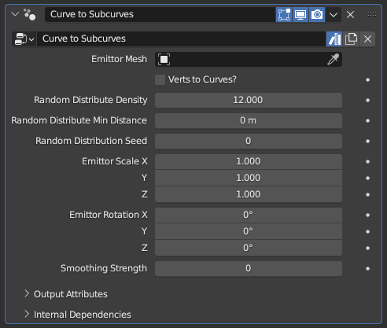

#  Curves to Subcurves

[TOC]

---

## Overview
This modifier generates subcurves that flow parallel to existing curves, with their distribution and spacing based on an emittor surface.

This modifier works in a similar way to [**Curves to Continuous Subcurves**](curve_to_cont_subcurves.md), but the end result prioritizes maintaining overall volume rather than the continuity of individual curves

<iframe width="560" height="315" src="https://www.youtube.com/embed/S-LmTkITiFU?si=NLCgdR45-1awzI0n" title="YouTube video player" frameborder="0" allow="accelerometer; autoplay; clipboard-write; encrypted-media; gyroscope; picture-in-picture; web-share" allowfullscreen></iframe>

---

## Parameters

* **Emittor Mesh:** The mesh object used to generate the subcurves, which controls the overall shape the generated curves will create.
* **Verts to Curves?:** By default, the generated curves have random spacing and density. When this option is enabled, every vertex of the **Emittor Mesh** will instead form a curve.
!!!tip "Practice!"
    This modifier may seem complicated on paper, but in practice it is very straightforward. Do not let the technical descriptions scare you, with a little bit of experimentation it should be very easy to understand

* **Random Distribution Density:** Controls how many subcurves will be generated per curve while **Verts to Curves?** is toggled off. This is an abstract number that controls overall density; setting it to 12 doesn't mean there will be 12 subcurves per curve
* **Random Distribution Min Distance:** Does nothing while set to 0 m. Higher values will delete curves that are within a certain distance to other curves, decreasing the total curve count and evening out the curve distribution.
!!!warning "Relativity of Min Distance"
    This parameter's effect may seem abstract or inconsistent, since its effect is relative to the geometry of the **Emittor Mesh** rather than the radii of the existing curves used to generate the subcurves. Two different curves with the exact same **Random Distribution Density** and **Random Distribute Min Distance** parameters can have wildly different subcurve distribution and counts based on the used **Emittor Mesh** obects

* **Random Distribution Seed:** Seed used for the random distribution. Change it if the end result seems off despite every parameter being set to appropriate values, and the end result will change arbitrarily
* **Emittor Scale X/Y/Z:** Scale value applied to the **Emittor Mesh** object before subcurves are generated from it
* **Emittor Rotation X/Y/Z:** Euler rotation applied to the **Emittor Mesh** object before subcurves are generated from it
* **Smoothing Strength:** Position smoothing applied to the subcurves, which may help with discontinuity
!!!tip "Alternatives"
    The smoothing applied by this parameter is very primitive. Using [**Smooth Curves**](../curve_manipulation/smoothen_curves.md) lets you have more control over which parts of which subcurves are smoothed out, and depending on the use case using [**Curves to Continuous Subcurves**](curve_to_cont_subcurves.md) can eliminate the need for smoothing entirely

---

## Tips & Use Cases

* Creating a **Linked Duplicate** (default: alt+D in Object mode) of your curve object, replacing this modifier with a [**Curve to Mesh**](../mesh_generation/curve_to_mesh.md), and setting the **Profile Curve** parameter to be the same as the **Emittor Mesh** may help visualize how the curve distribution works. 