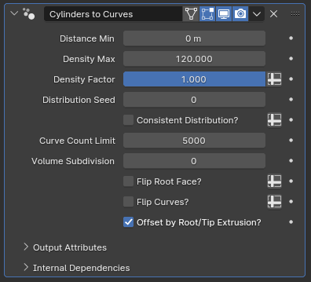

# Cylinders to Curves

[TOC]

---

## Overview
This modifier converts cylinder primitives within a mesh object to a set of curves following the overall shape of the cylinders.

---

## Parameters

* **Distance Min:** The minimum distance between the generated curves' root points. Set to zero to disable
* **Density Max:** Controls how many subcurves will be generated per cylinder. This is an abstract number that controls overall density; setting it to 12 doesn't mean there will be 12 subcurves per cylinder
* **Density Factor:** Additional multiplier for the density parameter. By pressing the spreadsheet icon to the right, a vertex group can be specified to locally control density.
* **Distribution Seed:** The random seed used to generate curves
* **Consistent Distribution?:** By default, curves are generated on the cylinders' faces based on their world space position, meaning cylinders with bigger root faces will have more curves generated in them. When this parameter is enabled, generation happens in the UV space instead, meaning adjustments to the cylinders in Edit or Sculpt mode will only affect curve positioning, not density

!!!tip "Local control with Vertex Groups"
    This parameter can also be locally controlled using vertex groups. By specifying a group, any cylinders where the value is set to at least 0.5 will use consistent distribution, while others will use world-space distribution. Combining this with locally controlled *Density Factor* can let you manage curve density much more precisely, but it would most likely still be easier to separate your cylinders into multiple objects and handle their parameters individually.

* **Curve Count Limit:** This parameter controls how many curves can be generated by this modifier in total. When working with large volumes, curve count can get out of hand, causing huge performance loss. This parameter mostly exists to prevent Blender from freezing up when making large adjustments, particularly when adding new cylinder primitives in Edit mode while *Consistent Distribution?* is off
* **Volume Subdivision:** Subdivision applied to the cylinders before generating the curves. Edges of the root and tip faces will be automatically set to crease, resulting in smoother curves with increased resolution

!!!tip "Manually Subdividing"
    You can also add a *Subdivision Surface* modifier before this one manually rather than using this parameter, if you prefer to smooth out the curve distribution without creasing or determining the creases in Edit mode, but you will need to set the *UV Smooth* parameter of the modifier to "None"

* **Flip Root Faces?:** Changes which flat face of the cylinder will be used to determine where the curve roots should be placed. 
* **Flip Curves?:** Reverses the curve direction without affecting curve generation

!!!tip "Effect of Faces on Curve Generation"
    While *Consistent Distribution?* is off, larger cylinders generate more curves. In cases where one flat face of a cylinder is a much bigger size than the other flat face, toggling *Flip Root Faces?* on or off can cause a significant change in curve count. For this reason, it is highly recommended that you set up all of your generative modifiers first and making sure the flat faces are oriented properly before you start making adjustments to the overall shape of the cylinders. Otherwise, you may need to rely on this toggle to fix orientation issues, which can drastically change the final curve distribution.

---

## Tips & Use Cases

* Due to how Blender tends to handle generative geometry node modifiers, it can be difficult to do live edits in a setup with multiple modifiers. Having a *Linked Duplicate* of your cylinder object with no modifiers and viewport visibility set to wireframe, and making edits on the linked duplicate instead can help you get instant feedback on your edits while simultaneously retaining ease of editing. Enabling *Retopology* shading from the Mesh Edit Mode Overlays panel can further help with visualizing.

* If used to make features like hair alongside [Curve to Mesh](../mesh_generation/curve_to_mesh.md) and curve deforming modifiers like Blender's built-in hair modifiers, it can be tricky to make minor, local adjustments without applying the modifier. In such cases, you can use a *Lattice*, *Mesh Deform* or *Surface Deform* modifier at the end of your modifier stack to make minor adjustments without having to apply the modifiers and working on the final result, retaining the conveniences of procedural workflows.

* If you're unsure about making adjustments in Edit mode and Sculpt mode, you can always make adjustments in shape keys so that you can undo edits or easily workshop different variations.

* This modifier relies on two specific properties of cylinder primitives: flat faces have dedicated corners in the UV grid and the faces connecting them have straight quad topology. Any operation that preserves these properties can be freely performed, including adding edge loops in any direction as well as inserting, extruding or even deleting the flat faces. Edge sliding can also be performed, but you will need to disable *Correct UVs* from the tool settings panel in order to avoid edge cases breaking the modifier. 