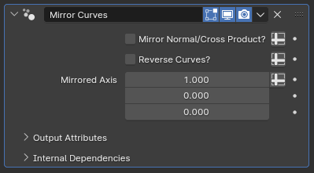

# Mirror Curves

[TOC]

---

## Overview
This modifier is the most straightforward of all modifiers, creating a duplicate of existing curves and mirroring them along the object space's X axis.

---

## Parameters

* **Tilt Fix:** While enabled, this parameter adjusts the mirrored curves' tilt so that their normals are symmetrical to the base curves' normals. While this is desirable for modifiers like [Curve to Mesh](../mesh_generation/curve_to_mesh.md), it can create problems for other modifiers like [Curve to Fur Curves](curve_to_furcurves.md) where the emitted fur curves will be inverted. Disabling **Tilt Fix** will disable this feature, mirroring only the position of the curves without affecting their tilt.

---

## Tips & Use Cases
* While simple, this modifier is very useful overall, as Blender's built-in **Mirror** modifier can only mirror mesh objects. 
* The order in which modifiers are evaluated has a significant impact on the end result. Having this modifier at the end of your modifier stack will result in absolute symmetry, but having it before [Random Trim Curves](../curve_manipulation/random_trim_curves.md), [Split Curve to Curves](split_Curve_to_curves.md) or the built-in hair deformation nodes can result in shapes that are symmetrical overall, but still retain small-scale differences for a more natural look
