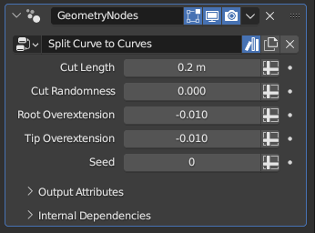

# Split Curve to Curves

[TOC]

---

## Overview
This modifier cuts existing curves into multiple curves at certain intervals, with parameters to control randomness of the intervals as well as giving you the option to extend the generated curves to overlap at their roots or curves

---

## Parameters

* **Cut Length:** The base interval the existing curves will be cut at, meaning the generated subcurves will be at this length. For curves whose length is not a multiple of this value, one or more of the resulting subcurves may be longer than this value
* **Cut Randomness:** While this parameter is set to zero, the modifier will try to make cuts at exact intervals equal to **Cut Length**. Increasing it will add in some randomness to the cut intervals, making the generated subcurves deviate from the cut length, with some being shorter and others being longer. 
!!!tip "Subcurve Count and Randomness"
    The total amount of generated subcurves is solely determined by the **Cut Length** parameter and the existing curves' length. Whether **Cut Randomness** is set to zero or one, the main curve will be cut the same amount of times, but in different spots along the curve

* **Root Overextension:** This parameter controls how much the subcurves will be trimmed or extended at their roots after the main curve is cut. Values below zero will trim the subcurves, while values above zero will extend their roots, overlapping their roots with the prior subcurves' tips
* **Tip Overextension:** Works the same as **Root Extension**, but for the tips of the generated subcurves
!!!warning "Relativity of Overextension/Trimming"
    The trimming or extension performed by the above two parameters is relative to the main curve's length, not the subcurves'. This means that if the discrepancy between the main curve length and the **Cut Length** parameter is too high, and the main curve is cut into too many subcurves, these parameters will require very little deviation from zero to have a noticeable impact.
---

## Tips & Use Cases

* Used alongside [Curves to Subcurves](curve_to_subcurves.md) and [Align Curve to Surface](../curve_manipulation/align_curve_to_surface.md), this modifier can be used to create features like fur or grass patches on surfaces, which can have a more evenly distributed and pleasant end result than using a dedicated modifier like [Curves to Fur Curves](curve_to_furcurves.md)