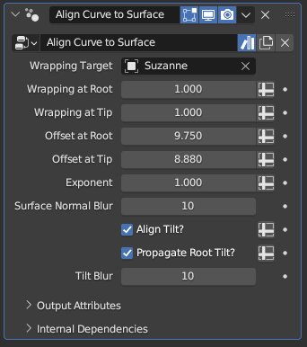

#  Align Curve to Surface

[TOC]

---

## Overview
This modifier shrinkwraps curves to a target object, optionally setting their tilt to align their normals with the surface's normals
and offsetting them by a fixed value along the curves' length

<iframe width="560" height="315" src="https://www.youtube.com/embed/EmVbIYzz-cM?si=yu6WKOBxW0LzkyX_" title="YouTube video player" frameborder="0" allow="accelerometer; autoplay; clipboard-write; encrypted-media; gyroscope; picture-in-picture; web-share" allowfullscreen></iframe>

---

## Parameters

* **Wrapping Target:** The target mesh to shrinkwrap the curves to
* **Wrapping at Root:** The wrapping factor to apply to the curve's root. While set to 1, the curve's root is placed immediately on the surface, At 0.5, the curve root will be placed halfway between its original position and the surface
* **Wrapping at Tip:** Works identically as above, but determines the wrapping applied to the curve's tip
* **Offset at Root:** How much offset will be applied to the curve's root after the wrapping takes place. The offset direction is the same as the surface normal of the point the curve is wrapped onto, and is also affected by the **Surface Normal Blur** parameter below
* **Offset at Tip:** Works identically as above, but determines the offset applied to the curve's tip

!!!tip "Relative Wrapping and Absolute Offsetting"
    Whereas the wrapping parameters are on a (0,1) range and work based on the initial distance between the curve and the surface, the offset parameters are absolute. Setting them to a particular value will offset them by that value along the surface normal, regardless of the initial distance between the curves and the surface.

* **Exponent:** The exponent for the blending between the root and the tip of the curves for above parameters, mathematically acting as a power for the spline factor. The default value of 1 causes the blending to be linear along the curve, while higher values makes the root parameters affect a larger portion of the curves.
!!!tip "Powers of Fractions"
    Due to how the power operation works for fractions, **Exponent** values below 1 will make the tip parameters affect a larger portion of the curve. However, this influence can cause very steep turns near the roots of the curves for low-resolution curves. This can be partially remedied by resampling the curves to very high resolutions before this modifier, and then resampling them down by length

* **Surface Normal Blur:** Smooths out the surface normals of the target mesh the curves are shrinkwrapped to, making the offset parameters have a smoother effect on curves that are wrapped onto more complicated shapes

!!!tip "Vertex Density and the Blur Operation"
    The Blur operation acts on vertex parameters, meaning that the end result will end up favoring the normals of areas with high vertex density. Meshes with more even vertex distribution will have smoother, more even normals after blurring as a result.

* **Align Tilt?:** While enabled, the curves' tilt will be overwritten by a value that aligns their normals with the normals of the surface they're shrinkwrapped onto.
* **Propagate Root Tilt?:** By default, if **Align Tilt?** is enabled, every curve point will have its own tilt aligned with the normal of the surface it is shrinkwrapped onto. When this parameter is toggled on, only the curve root will have its normal aligned with the surface, and the tilt value of the root will be applied to the rest of the curve instead. 
* **Tilt Blur:** Works identically to the **Surface Normal Blur** parameter, but whereas the Surface Normal Blur parameter smooths out the normals for the purpose of offsetting, this parameter smooths the normals for the purpose of tilt alignment.

## Tips & Use Cases

* This modifier is very useful when making a wide variety of features, from hair to fluff to tails. Particularly when modeling hair, you can create a proxy object that has minimal detail just to align curves to, as it is much easier to specify a shape and orientation for the hair volume with sculpting and mesh editing tools than it is with curve editing tools