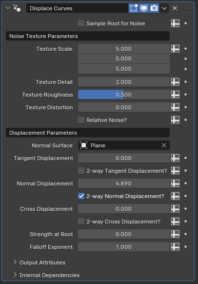

#  Displace Curves

[TOC]

---

## Overview
This modifier offsets curves based on their parameters using a noise texture. 

<iframe width="560" height="315" src="https://www.youtube.com/embed/5Ojk_yXwmrQ?si=ruPVZezyH2mEUREB" title="YouTube video player" frameborder="0" allow="accelerometer; autoplay; clipboard-write; encrypted-media; gyroscope; picture-in-picture; web-share" allowfullscreen></iframe>

---

## Parameters

* **Sample Root for Noise:** By default, this modifier generates the noise texture based on world-space coordinates of each individual curve point, meaning there will be variance in displacement direction and strength based on where the curves' points are. When this toggle is enabled, only the root's position of each individual curve will be used for the rest of the curve's displacement as well, providing a more consistent displacement.
* **Texture Scale:** Controls the scale of the vector input of the noise texture. By default, it scales the X, Y and Z axis coordinates in world space
* **Texture Detail:** Affects the number of noise octaves for the generated texture
* **Texture Roughness:** Controls the blending between a smoother noise pattern and a rougher pattern with sharp peaks
* **Texture Distortion:** Amount of distortion applied to the noise texture

!!!tip "Noise Texture Node"
    The Noise Texture node exists both in geometry nodes and shader nodes. If you find it hard to visualize how each parameter affects the final result, it may be helpful to toy with the node within shader nodes to get a better idea of how it works.

* **Relative Noise?:** When this option is enabled, rather than using world-space coordinates, this modifier will use the spline index as the X and Z coordinates and spline factor as the Y coordinate of the noise texture's coordinate input. 

!!!warn "Scale Relativity"
    This parameter also affects the **Texture Scale** parameter's impact on the effect, meaning that enabling this and setting the first input of the texture scale to zero will make every curve have the exact same noise, and adjusting the second input will adjust how much variance the noise gets along the curves' lengths. While Relative Noise enabled, the third input of Texture Scale will act as a sort of offset on the first input

* **Normal Surface:** By default, the offsetting applied to the curves is based on their normals and tangents. When a mesh object with a surface is specified in this parameter, the surface normal of the nearest surface of this object is used instead of the curve's own normal in the calculations.

!!!tip
    This parameter also takes **Sample Root for Noise** into consideration. If Sample Root for Noise is disabled, every curve point will individually check for the nearest surface, but if it is enabled only the root will check for the nearest surface, and every other curve point will use the surface nearest to its root instead.

* **Tangent Displacement:** The scale of the offsetting applied along the curve's tangent. Higher values mean more displacement.
* **2-way Tangent Displacement?:** While disabled, the offsetting only happens in the positive direction along the tangent. Enabling this parameter allows some curve points to be offset in the negative direction as well.
* **Normal Displacement:** The scale of the offsetting applied along the curve's normal if no mesh object is specified in **Normal Surface**, or along the nearest surface normal if an object is specified
* **2-way Normal Displacement?:** Same as **2-way Tangent Displacement**, but for the normal displacement
* **Cross Displacement:** The scale of the offsetting applied along the cross product of the curve's tangent and the normal vector. The normal vector is the same as above, meaning it'll be the curve's normal if there is no object specified for **Normal Surface**, or the nearest surface's normal if an object is specified.
* **2-way Cross Displacement?:** Same as above, but for the cross product vector displacement.
* **Strength at Root:** Multiplier to the displacement applied at the roots of the curves. Values above control the displacement applied to the tips of curves
* **Falloff Exponent:** How the blending between the tips and roots of curves is calculated for the purposes of multiplying the displacement values with **Strength at Root**. With a value of one, the blending is linear. Higher values increase the influence of the root while lower values increase the influence of the tip

---

## Tips & Use Cases

* This modifier is very useful when trying to make organic-looking hair and fur. 
* If paired with cyclic curves and [Bridge Curves with Subcurves](../curve_generation/bridge_curves_with_curves.md), enabling **Relative Noise**, setting the first texture scale parameter to an integer and third texture scale parameter to zero will effectively loop the offsetting applied to the subcurves along the cyclic curves, which can make it useful when modeling skirts or long dresses for a figure model