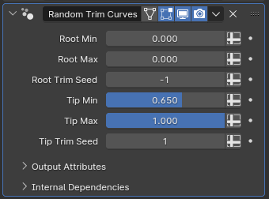

# Random Trim Curves

[TOC]

---

## Overview
This modifier shortens curves by randomly trimming their roots or tips based on how the parameters are set

---

## Parameters

* **Root Min:** The minimum trimming applied to the roots of curves
* **Root Max:** The maximum trimming applied to the roots of curves
* **Root Trim Seed:** Determines the random number generated for the root trimming
* **Tip Min:** The minimum trimming applied to the tips of curves
* **Tip Max:** The maximum trimming applied to the tips of curves
* **Tip Trim Seed:** Determines the random number generated for the tip trimming

!!!warn "Trimming by Spline Factor"
    All of the trimming amount parameters are relative to the spline factor, where zero represents the root and one represents the tip. The default values will not trim the roots, and randomly trim the tips by up to 35%. In order to further trim the tips, you will need to actually reduce the tip trimming parameters

---

## Tips & Use Cases

* By setting the root trim seed and tip trim seed to be the same integer, you can have symmetrically trimmed curves.

* Modifiers like [Align Curve to Surface](align_curve_to_surface.md) and [Transfer Radius and Tilt](transfer_radius_and_tilt.md) also use spline factor for their internal calculations. When using this modifier alongside such modifiers, you may run into unexpected behaviour depending on their ordering. In such cases, make sure to try alternate orderings to see how they work together.