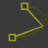
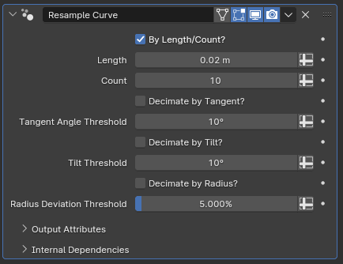

#  Resample Curve

[TOC]

---

## Overview
This modifier allows you to have manual control over how many points there are in a curve by either setting a fixed number or by setting a distance value between each point. It also has additional controls for culling points based on how little they contribute to the shape of a curve.

<iframe width="560" height="315" src="https://www.youtube.com/embed/XsYVVG57BZ4?si=5obPYUJNX1BjyHCL" title="YouTube video player" frameborder="0" allow="accelerometer; autoplay; clipboard-write; encrypted-media; gyroscope; picture-in-picture; web-share" allowfullscreen></iframe>

---

## Parameters

* **By Length/Count?:** This parameter controls how the point count per curve is determined while resampling. While toggled off, **Length** parameter is used to resample the curves, where each curve will have evenly distributed points such that the distance between each consecutive pair of points will equal the length parameter. While it is toggled on, every curve will have a fixed amount of points determined by the **Count** parameter
* **Length:** While above parameter is toggled off, determines the point density of curves, with lower values creating higher resolution curves
* **Count:** While **By Length/Count?** is toggled on, determines the exact count of points each curve has
* **Decimate by Tangent?:** When toggled on, curves will have their points erased if the angles between the tangent of a point and tangents of its neighboring points are below a certain degree, determined by below parameter
* **Tangent Angle Threshold:** Determines the cutoff angle for the decimation condition described above
* **Decimate by Tilt?:** Same as above, but comparison is made between the points' tilt attributes rather than their tangents
* **Tilt Threshold:** Same logic as **Tangent Angle Threshold**, but for above parameter
* **Decimate by Radius?:** Same as the two decimation toggles as above, but comparison is made between the radius attribute rather than tangents or tilts
* **Radius Deviation Threshold:** Same as the two above thresholds, but rather than comparing degrees, the comparison is made by calculating the percentage deviation between neighboring points. For example, if set to 10%, a point with a radius of 10 will be decimated if either of its neighbors has a radius between 9 and 11

!!!tip "Multiple decimation conditions at once"
    When enabled on their own, above parameters work as described. However, if multiple different decimation parameters are enabled at once, points are decimated only and only if they fall within the decimation thresholds of each parameter.

!!!warn "Decimation for high resolution curves"
    The decimation parameters are more useful for high resolution curves, but they're also harder to configure for such curves as the deviation between curve points will be smaller and smaller as the resolution increases. It may be a smart idea to save a backup before making further adjustments if you're relatively happy with a setup.

---

## Tips & Use Cases

* While it can be used to smooth out curves or boost resolution, increasing resolution determines the extra point position by interpolation. There is no workaround for curves generated from scratch or from mesh objects like from the [Cylinders to Curves](../curve_generation/cylinders_to_curves.md) modifier, but when working with curve objects you should strive to keep the curve resolution parameter as high as your computer can handle without performance problems and then use this modifier to reduce point count instead for the smoothest end result.