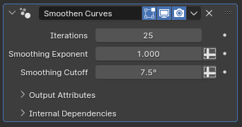

# Smoothen Curves

[TOC]

---

## Overview
This modifier smooths out midpoints of curves based on their tangent deviation while not affecting their roots and tips

---

## Parameters

* **Iterations:** How many times the smoothing algorithm will be applied to the curves in the object. This parameter can tank performance if set to a high value on an object with many curves
* **Smoothing Exponent:** The strength of the smooting is more severe for points where the tangents of adjacent points create a narrower angle, and the effect is more subtle for wider angles. This parameter controls this blending, where values lower than one will make the modifier have a higher impact on wider angles as well, while values higher than one will reduce the effect on points with wider angles
* **Smoothing Cutoff:** Points with tangent angles above this will not be affected by the smoothing algorithm at all. This parameter can be easier to understand and configure than **Smoothing Exponent**, with the added benefit that as these points are completely excluded from the smoothing process it can also have a significant impact in performance, improving calculation speeds for high iteration counts

---

## Tips & Use Cases

* The smoothing effect of this modifier will also somewhat normalize the distance between curve points. If placed after a [Resample Curves](resample_curves.md) modifier with decimation parameters enabled, this can cause the shape defined by the curve to be significantly altered.
