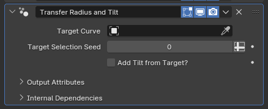

# Transfer Radius and Tilt

[TOC]

---

## Overview
This modifier takes the radius parameter of curves from one curve object, and overwrites the radius parameter of curves in the object with them. If enabled, it can also add the targets' tilts to the curves.

---

## Parameters

* **Target Curve:** The curve object to sample the radius parameters from.
* **Target Selection Seed:** If the target object has multiple curves, each curve from the object with this modifier will sample a different curve from the target object for their radii and tilts. This parameter controls the randomness for this selection
* **Add Tilt from Target?:** If enabled, adds the tilt parameter of the target objects' curves onto this object

---

## Tips & Use Cases

* This modifier is crucial for most curve generating modifiers, as generated curves have a fixed radius of one and no means of editing them without applying the curve generating modifier. In most cases, you'll likely want to place this modifier immediately before a modifier that'll convert the curves into meshes