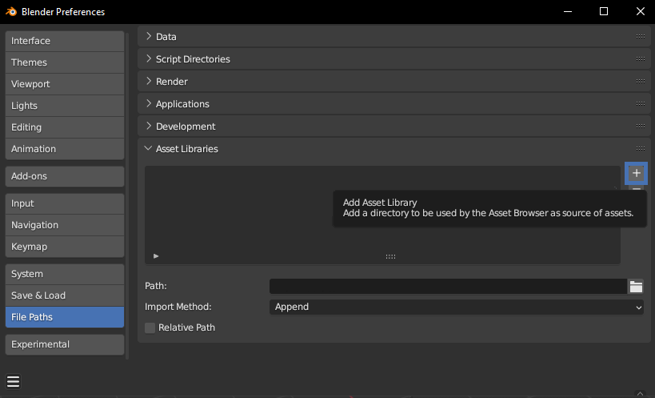
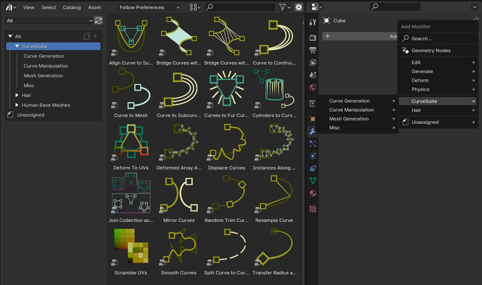

# CurveSuite

CurveSuite is a collection of geometry node-powered modifiers designed to procedurally model shapes 
and features that are hard or time-consuming to create manually. This website contains the documentation
for how to prepare the modifiers, how each one works, and example workflows to demonstrate use cases for each one.

[TOC]

---
## Overview

CurveSuite is separated into three categories based on what their functionality is at the most base level. 

* **Curve Generation** modifiers take existing curves or meshes, and generates additional curves from them, ultimately increasing total curve count.

* **Curve Manipulation** modifiers change the properties of existing curves without affecting total curve count.

* **Mesh Generation** modifiers take curve objects and uses them to generate procedural or instanced mesh geometry.

A typical workflow for creating objects with CurveSuite modifiers will involve a mixture of curve generation and manipulation modifiers, followed by one mesh generation modifier, possibly followed by Blender's own mesh manipulation modifiers. Curve generation and manipulation modifiers can be used in any order, and different permutations of the same modifiers can result in vastly different end results.

---
## Installation

The ideal workflow regarding how to initialize the modifier depends on personal preference, but the collection
is designed to be used with Blender's built-in Asset Browser window.

CurveSuite is delivered as a .zip file containing two folders and a text file. 
* The folder named "CurveSuite" contains the .blend files with each individual modifier, and is the file meant to be added to your asset library
* The folder named "Example Workflows" contains the project files for the example workflow tutorial videos, for those who want to inspect them
* The README.txt file contains a brief explanation of the contents and how to install, similar to this webpage

* Unzip the "CurveSuite" folder into any location on your PC. Make sure to unzip the folder itself as is, and not the individual files  
!!!warning "File Path Relativity"
    It is advisable to unzip the folder into a static location, as changing the folder location later on can break your asset library, and in turn break your .blend files, requiring you to assign the modifiers one by one again
  
* Open Blender and under the Edit panel on the top left, select Preferences  

* In the Blender Preferences window, go to the File Paths tab, and under the Asset Libraries category press the **+** button  
to the right to open up the file selection window
  

* In the file selection window, navigate to the **folder** you unzipped the contents of the .zip folder to, and press **Add Asset Library**  
!!!warning "Selecting The Folder"
    Make sure that you select the **folder** the .blend files and the blender_assets.cats.txt file are located inside. If selecting correctly, there should be nothing visible in the actual file explorer window, with the file address ending in "CurveSuite" similar to the example below:

* Switch one of your editor panels to the Asset Library editor  
  

* You can now use the modifiers by dragging the one you want from this window over onto the object you want to add the specific modifier to, which will add the modifier to the end of its modifier stack, or you can directly search for the individual modifiers within the Modifiers panel of the object you want to add them to as you would with any other modifier
  

    
!!!tip "Import Method"
    At the top of the Asset Library editor window, there is a drop-down menu set to 'Follow Preferences', which is 'Append (Reuse Data)' by default. This will make Blender create a copy of the modifier in your file as opposed to directly using the modifier within the library. By setting this to 'Link' in either your Preferences window or in the Library Editor window, you can make sure that the imported modifiers respect any changes you may make to the modifiers, or updates to the files in the library folder

---

## Important Tips!

* Once your objects are finalized, you can apply all modifiers at once by using the **Convert to Mesh** function of Blender. Applying one by one may cause unexpected changes, or in the case of certain modifiers that change object type, may not be doable at all.

* Most of the modifiers in ScatterSuite utilize curves in one way or another. If you don't have much experience working with curves, it is highly recommended that you first familiarize yourself with them, particularly with Bézier curves

* The built-in hair assets provided by the Blender Foundation work directly with all curves, meaning they can be used alongside CurveSuite modifiers. 

* Modifiers affect the geometry in a sequential order, with the highest modifier in the list applying first and lower modifiers applying to the result of the prior modifier. This means that a change in the order of modifiers can have a large impact on the end result. For example, placing [Curve to Curves](curve_generation/curve_to_subcurves.md) first and [Align Curves to Surface](curve_manipulation/align_curve_to_surface.md) second will cause the subcurves generated by **Curve to Curves** to align with the surface, while the reverse order will only align the curve used for the generation of the subcurves

* By creating a **Linked Duplicate** of an object (default Alt+D) you can have multiple objects using the same mesh or curve data, with each duplicate retaining its own modifier stack. This can allow you to use the same mesh or curve data for multiple different generation setups, or to compare different modifier and parameter combinations in real-time as you make adjustments to the geometry data. However, make sure that you create a separate copy before applying modifiers as applying them for one linked object can affect all the other linked ones.

* Any edited parameters can be returned to their base value by pressing **Backspace** while your mouse is hovering over them.

---
