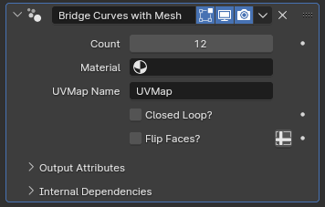

#  Bridge Curves with Mesh

[TOC]

---

## Overview
This modifier stretches an UV grid to follow the shape of curve objects, helping with the generation of surfaces that have mathematical shapes

<iframe width="560" height="315" src="https://www.youtube.com/embed/LpXQQF5sdac?si=PRD82c8_OE7f2qxk" title="YouTube video player" frameborder="0" allow="accelerometer; autoplay; clipboard-write; encrypted-media; gyroscope; picture-in-picture; web-share" allowfullscreen></iframe>

---

## Parameters

* **Count:** The amount of edge loops generated to bridge the curves with. When set to zero, uses the evaluated resolution of the longest curve within the object to determine the count. If set to zero, the modifier will use the resolution of the curve with most points within the curve object as the resolution of the grid.
* **Material:** The material assigned to the generated surface
* **UVMap Name:** The name the default UVMap of the surface will be saved under. By default, the X axis of the UV map is equal to the spline factor of the main curves the UV grid is stretched onto, while the Y axis is based on the index order of the curves the grid is stretched across, with the starting curve having a Y coordinate of 0 and the last curve having a Y coordinate of 1
* **Closed Loop?:** If enabled, bridges the start and end of the generated grid with another row of faces. Might be useful if this modifier is used alongside [Bridge Curves with Mesh](../curve_generation/bridge_curves_with_curves.md), or with cyclic curves
* **Flip Faces?:** Flips the normals of the generated grid. 

---

## Tips & Use Cases

* While you can control the loop cut count along the X axis of the UV map for the resulting surface, this modifier has no built-in way to subdivide along the Y axis.
You can pair this modifier with [Bridge Curves with Curves](../curve_generation/bridge_curves_with_curves.md) to have more control in both the X axis and Y axis resolution without having to manage dozens of curves inside the same object

* The order in which curves are bridged is dependent on the curve indices. Typically, the 'oldest' curve in a curve object has the lowest index, with the most recently generated one having the highest index. Deleting curves will never break the ordering, but adding in a new curve will always add it to the end of the order. If you wish to add in a new curve to the middle of the bridge order, you may select all curves after the curve you wish to add in a new curve after, **Separate** (default: P in Edit mode) them to a new curve object, add in your new curve, and then **Join** (default: ctrl+J in Object mode) the two curve objects back together.

