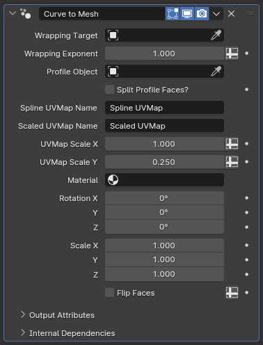

# Curve to Mesh

[TOC]

---

## Overview
This modifier converts all the curves within an object into surfaces using another object's geometry to determine the bevel shape.

---

## Parameters

* **Wrapping Target:** If set to a mesh object, the surface generated by this modifier will be shrinkwrapped to the target, with vertices that were generated on the curve's root being wrapped directly onto the surface and the vertices generated on the tip not being affected at all.
* **Wrapping Exponent:** The exponent for the blending between the root and the tip of the curves for the shrinkwrapping, mathematically acting as a power for the spline factor. The default value of 1 causes the blending to be linear along the curve, while higher values makes the root parameters affect a larger portion of the curves.
!!!tip "Powers of Fractions"
    Due to how the power operation works for fractions, **Exponent** values below 1 will make the tip parameters affect a larger portion of the curve. However, this influence can cause very steep turns near the roots of the curves for low-resolution curves. This can be partially remedied by resampling the curves to very high resolutions before this modifier, and then resampling them down by length
!!!warning 
    This wrapping operation is very primitive, and is very unlikely to have good results unless other parts of your objects were designed with it in mind. It only exists because Blender's built-in **Shrinkwrap** modifier cannot be added to curve objects. It is highly recommended that you worry about shrinkwrapping after you apply all modifiers and convert your curve objects into mesh objects to have access to mesh-specific editing tools and modifiers.

* **Profile Object:** The object that defines the bevel shape. Unlike Blender's built-in Bevel option for curves, this object is not limited to curves, and can be a mesh object instead
!!!tip "Built-in Limitations"
    If a mesh object is selected for the profile shape, it will first be converted to a curve by deleting all edges that neighbor more than one face. This is a mostly safe operation, but you may still get unexpected results in edge cases, and it may be safer to convert your profile mesh object to a curve manually

* **Split Profile Faces?:** When enabled, this option will separate the profile object to singular edges before converting your curves to meshes, to simulate split normals. This increases vertex count, but not face count.
* **Spline UVMap Name:** The name for the attribute that stores curve parameters after the curve has been converted to a mesh, essentially acting as a UV map. The profile curves are mapped to the X axis, while the main curves that are converted to mesh are mapped to the Y axis, with their roots mapped to 0 and their tips mapped to 1.
* **Scaled UVMap Name:** Similarly to **Spline UVMap Name**, this parameter is used to save what is essentially an UVMap, but rather than forcibly fitting the UVs to the UV grid, the UV map stored by this parameter accounts for the length difference of curves. Longer curves can have Y-axis values greater than 1 in the UV space, and shorter ones can cover a smaller section of the UV space. This can be very useful when combined with procedural or repeating textures
* **UVMap Scale X/Y:** Multiplier for the UV scales for the map stored by the **Scaled UVMap Name** parameter. This can let you compensate for scale discrepancies between your texture and geometry quickly without having to resort to a mapping node within shader nodes.
* **Material:** The material assigned to the generated mesh
* **Rotation X/Y/Z:** The rotation applied to the profile object before it is used to define the bevel shape
* **Scale X/Y/Z:** The scaling applied to the profile object before it is used to define the bevel shape, useful if you use the same **Profile Object** for multiple modifiers but want to make adjustments on one object without affecting the others
* **Flip Faces:** When enabled, flips the face normals for the final result. The final result may have inverted normals if the **Profile Object** has a negative scale, this option lets you fix this without having to adjust other parameters.

---

## Tips & Use Cases

* When selecting an object for the profile, this modifier uses the object space center to be the point of reference for mesh generation. This means that you can offset the profile object in Edit Mode to create shapes like spirals or springs very easily and intuitively

