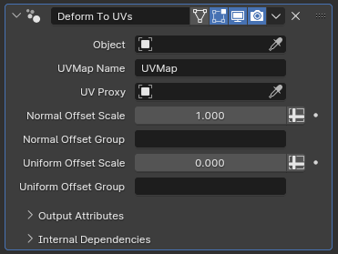

# Deform To UVs

[TOC]

---

## Overview

This modifier takes an existing target object and instances it on the mesh object with this modifier, using its tangent space to calculate the instanced object's position. The end result is a highly deformed instance that follows the initial mesh object's surface.

---

## Parameters

* **Object:** The target object to be deformed onto this object's tangent space
* **UVMap Name:** The UV map that will be used to calculate the tangent space
* **UV Proxy:** When left blank, the tangent space calculation will be performed by taking the bounding box of the target object, and taking the XY plane going through the center of the bounding box to correspond to the main object's UV coordinates. If another object with the same UV map is selected as a UV proxy, the target object's surface will be used for the deformation instead
* **Normal Offset Scale:** While the XY coordinates of the instanced geometry is calculated using UV coordinates, the displacement along the surface is calculated by distance. This parameter essentially allows for scaling the instanced object along the main object's surface normals
* **Normal Offset Group:** If set to the name of a vertex group from the main object, the **Normal Offset Scale** parameter will be multiplied by this vertex group, allowing for local adjustment of the normal offset scale
* **Uniform Offset Scale:** While the **Normal Offset Scale** parameter offsets the instance vertices based on their distance to the center XY plane of the target object's bounding box, or to the UV Proxy object's surface if a **UV Proxy** is specified, this parameter pushes the instances away or pulls them into the main object's surface uniformly, disregarding their initial distance. 
* **Uniform Offset Group:** Similarly to the **Normal Offset Group** parameter, this parameter lets you locally control the **Uniform Offset Scale** by specifying a vertex group that exists on the main object.

---

## Tips & Use Cases

* This modifier is much more straightforward to use than it may initially seem from its description. It is highly recommended that you toy around with it using a UV grid as a main object with this modifier, and an easily orientable object like Suzanne as the target object to better understand it, if reading parameters or watching videos on it don't help you understand it

* While there are no technical limitations to what sort of topological shape can be used as a UV proxy, most shapes won't be of much use. However, using cylinders or UV spheres can be a cheap way to "unwrap" details of more complex shapes onto a simple UV grid.

* Both the target object and the UV proxy object are taken in their final form by this modifier, meaning you can use modifiers like Array on the UV proxy object to help make looping patterns, or deform instances in their base form with other modifiers before instancing them onto other objects. 

* This modifier is fully compatible with any mesh that has a UV map, including those generated with [Curve to Mesh](../mesh_generation/curve_to_mesh.md) or [Bridge Curves with Mesh](../mesh_generation/bridge_curves_with_mesh.md), as long as the proper UV map name is specified. As it is typically easier to adjust the resolution of curve-based objects, it can be easier 

* While powerful, this modifier can be tricky to use. [Deformed Array Along Curves](deformed_array_along_curves.md) or [Instances Along Curves](instances_along_curves.md) can provide a simpler alternate for some use cases