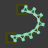
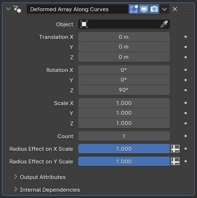

#  Deformed Array Along Curves

[TOC]

---

## Overview

This modifier serves as an alternate to Blender's built-in Array+Curve Deform modifier combination, providing a less obtuse setup process

<iframe width="560" height="315" src="https://www.youtube.com/embed/MZTloVeeI2E?si=IQDIQlZXuUXmX3XH" title="YouTube video player" frameborder="0" allow="accelerometer; autoplay; clipboard-write; encrypted-media; gyroscope; picture-in-picture; web-share" allowfullscreen></iframe>

---

## Parameters

* **Object:** The target object to be deformed onto the curves within this curve object
* **Apply Transforms?:** While this parameter is enabled, the object scale and rotation of the target object will be applied before instancing it along the curves. If disabled, the instances will use a version of the object where its scale is set to 1 and its rotation is reset. 
* **Use Center as Origin?:** While this parameter is disabled, instances are placed along the curve such that the object's origin will perfectly line up with the curve, assuming the **Translation** parameter is left untouched. This can cause the instances to be offset away from the curve, or offset along its length if the actual mesh of the target object is far away from the object's origin. Enabling this parameter calculates the geometric center of the target object and uses it as the reference point rather than the object's origin, negating the offsetting.

!!!tip "Offsetting isn't necessarily bad!"
    An intelligent but offset placement of the target object's origin can be useful when implementing certain effects. For example, keeping the object origin away from the mesh and adjusting the tilt of your curve can let you create spiral or helical shapes. Another example of potential benefit is that since all transformations are more severe the further they're applied from their reference point, offsetting the object origin can let you scale your instances in ways that are more practical for features like animal tails.

* **Bounding Box Group:** If a vertex group from the **Object** is specified here, vertices that don't belong to this group will be deleted when calculating the bounding box for instancing. These vertices will still exist in the final geometry, but specifying a group here allows the instanced geometry to overlap, which can be useful in certain scenarios
* **Group Cutoff:** When a group name is specified in **Bounding Box Group**, vertices with a weight below this factor will be deleted for the bounding box calculations.

!!!warn "Root and Tip Extension"
    Because of how the instancing works, if using **Bounding Box Group** or an object where the actual mesh is too far away from the object's origin, you may end up with instances that spill outside of the curve. In such cases, it may be a good idea to pair this modifier with [Random Trim Curves](../curve_manipulation/random_trim_curves.md) before making adjustments in Edit Mode to test variations of whatever it is you're working on.

* **Translation X/Y/Z:** How much the target object will be translated in its own object space before being instanced
* **Rotation:** How much the object will be rotated, and along which axes, before being instanced. The default rotation is set so that the target object's Y axis lines up with the curve tangent
* **Scale X/Y/Z:** The scaling applied to the target object before instancing. 
* **Count:** How many of the target object will be instanced along each curve. This is a fixed count per curve, and is independent from curve resolution or how many control points a curve has 

!!!warn "Resolution still matters!"
    Because this modifier still uses the curve resolution to calculate the final position of instance vertices, you are still recommended to avoid using low resolutions on your curve objects, particularly when instancing higher poly-count models, in order to avoid the final result looking blocky.

* **Radius Effect on X Scale:** How much the radius parameter of the curve will affect the scale of the instances along their X axis. If set to zero, radius will have no effect.
* **Radius Effect on Y Scale:** Same as above, but for the Y axis. 

---

## Tips & Use Cases

* Using this modifier alongside [Align Curve to Surface](../curve_manipulation/align_curve_to_surface.md) can simplify adding in features such as dorsal spikes to existing models
