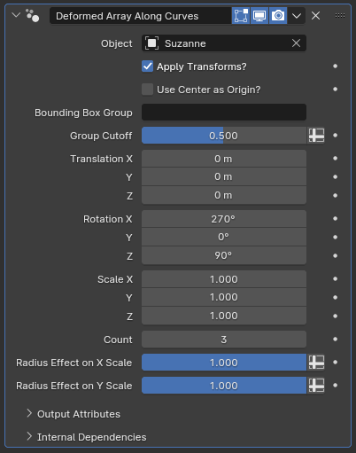

# Deformed Array Along Curves

[TOC]

---

## Overview

This modifier serves as an alternate to Blender's built-in Array+Curve Deform modifier combination, providing a less obtuse setup process

---

## Parameters

* **Object:** The target object to be deformed onto the curves within this curve object
* **Translation X/Y/Z:** How much the target object will be translated in its own object space before being instanced
* **Rotation:** How much the object will be rotated, and along which axes, before being instanced. The default rotation is set so that the target object's Y axis lines up with the curve tangent
* **Scale X/Y/Z:** The scaling applied to the target object before instancing. 
* **Count:** How many of the target object will be instanced along each curve. This is a fixed count per curve, and is independent from curve resolution or how many control points a curve has 

!!!warn "Resolution still matters!"
    Because this modifier still uses the curve resolution to calculate the final position of instance vertices, you are still recommended to avoid using low resolutions on your curve objects, particularly when instancing higher poly-count models, in order to avoid the final result looking blocky.
* **Radius Effect on X Scale:** How much the radius parameter of the curve will affect the scale of the instances along their X axis. If set to zero, radius will have no effect.
* **Radius Effect on Y Scale:** Same as above, but for the Y axis. 

---

## Tips & Use Cases

* Using this modifier alongside [Align Curve to Surface](../curve_manipulation/align_curve_to_surface.md) can simplify adding in features such as dorsal spikes to existing models
