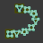

#  Instances Along Curves

[TOC]

---

## Overview

This modifier is a more primitive version of [Deformed Array Along Curves](deformed_array_along_curves.md), but allows using collections rather than singular objects to allow user-defined variations at the expense of instances that fully deform along the curves.

---

## Parameters

* **Collection:** The collection to select objects from to instance along the curves
* **Base Scale:** The scaling applied to the objects in the collection
* **Radius Effect on X:** How much the radius parameter of the curves will affect the scale of the instances along their X axes
* **Radius Effect on Y:** Same as above, but along their Y axes
* **Radius Effect on Z:** Same as above, but along their Z axes
* **Count:** How many instances will be placed along each curve. Set to zero to use the curve's own resolution instead
* **Seed:** While this value is zero, objects are picked from the collection in sequential order for the instancing. Setting it to any other value will make it so they're picked randomly instead, with no discernible pattern
* **Tangent Rotation:** Rotates the instances by set amount along the curve tangents
* **Normal Rotation:** Rotates the instances by set amount along the curve normals
* **Alignment Target:**

---

## Tips & Use Cases

* This modifier is much more straightforward to use than it may initially seem from its description. It is highly recommended that you toy around with it using a UV grid as a main object with this modifier, and an easily orientable object like Suzanne as the target object to better understand it, if reading parameters or watching videos on it don't help you understand it

* While there are no technical limitations to what sort of topological shape can be used as a UV proxy, most shapes won't be of much use. However, using cylinders or UV spheres can be a cheap way to "unwrap" details of more complex shapes onto a simple UV grid.

* Both the target object and the UV proxy object are taken in their final form by this modifier, meaning you can use modifiers like Array on the UV proxy object to help make looping patterns, or deform instances in their base form with other modifiers before instancing them onto other objects. 

* This modifier is fully compatible with any mesh that has a UV map, including those generated with [Curve to Mesh](../mesh_generation/curve_to_mesh.md) or [Bridge Curves with Mesh](../mesh_generation/bridge_curves_with_mesh.md), as long as the proper UV map name is specified. As it is typically easier to adjust the resolution of curve-based objects, it can be easier 
