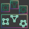
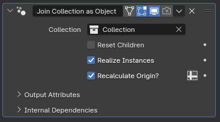

#  Join Collection as Object

[TOC]

---

## Overview
This modifier combines multiple objects from the same collection into one object, allowing other modifiers that normally only accept one object input to rely on the geometry data of multiple objects, or to daisy-chain mesh-specific modifiers that normally aren't available for curve objects such as [**Data Transfer**](https://docs.blender.org/manual/en/latest/modeling/modifiers/modify/data_transfer.html)

<iframe width="560" height="315" src="https://www.youtube.com/embed/XiPDXwgTTCE?si=ClYt9R4SAp7SbbZ4" title="YouTube video player" frameborder="0" allow="accelerometer; autoplay; clipboard-write; encrypted-media; gyroscope; picture-in-picture; web-share" allowfullscreen></iframe>

---

## Parameters

* **Collection:** The collection that will be joined under this object
* **Reset Children:** If enabled, transforms of the objects in the collection will be reset before they're joined, setting their position to the world origin, removing any rotation and setting their scale to be (1,1,1)
* **Realize Instances:** If enabled, joined objects will be turned from instances into separate meshes. Disabling this may slightly improve performance if you're using this modifier to instance more than one object at once with another modifier, but 
* **Recalculate Origin?:** While disabled, joined geometry will be placed wherever they were, then offset by the object origin of the object with this modifier, which can make positioning the geometry confusing. When this parameter is enabled, the geometric center of both all the objects in the targeted **Collection** as well as the geometric center of the mesh of this object will be calculated, and the instanced objects will be positioned such that their geometric center aligns with the geometric center of this object before this modifier

!!!tip
    If you're having trouble positioning the origin for this mesh, it can be useful to merge all the vertices into one single point. With only one vertex, the position of that vertex will be the new center.

!!!tip
    When **Realize Instances** is disabled, the calculated origin will be based on the object origins of the joined objects rather than geometric center.

---

## Tips & Use Cases

* This modifier can be used to combine multiple procedurally modeled features to be instanced by a different modifier that normally only accepts a single object input, such as [Deformed Array Along Curves](../mesh_generation/deformed_array_along_curves.md).