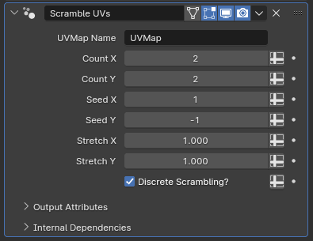

# Scramble UVs

[TOC]

---

## Overview
This modifier takes the UV map of an existing object's islands, rescaling and translating them across the UV grid randomly. This allows meshes with simple UV maps, like grids, to utilize texture maps with multiple variations when used to create features like feathers and scales

---

## Parameters

* **UVMap Name:** The UV map this operation will be performed on
* **Count X:** Controls how many regions the UV space will be separated into along the X axis
* **Count Y:** Same as above, but for the Y axis

!!!tip "Example included in .blend file"
    The easiest way to understand how these two parameters work would be to create a new plane object with a color grid texture, and simply adjusting them. Such a setup is included in the .blend file this modifier is packed in

* **Seed X:** Random number generation seed used for the **Count X** parameter
* **Seed Y:** Same as above, but for the **Count Y** parameter
* **Stretch X:** Controls the "overflow" of the resulting UVs in the X axis direction. By default, the UV grid is perfectly fit into rectangular regions defined by the **Count X** and *Count Y** parameters and then the existing UV map is transformed to fit into these rectangles as accurately as they fit the initial UV grid. Increasing this parameter will push the UVs away from the center of the rectangular subregion along the X axis, while decreasing it will pull them towards it
* **Stretch Y:** Same as above but for the Y axis
* **Discrete Scrambling?:** When this parameter is enabled, the UV grid is separated into rectangles that do not overlap by above parameters, assuming the stretch parameters are left at one. While it is off, the subregions are placed in a completely random manner, with the only guarantee being that they will still remain within the bounds of the UV grid as long as the stretch parameters are not higher than 1. Disabling this may make the modifier more useful for continuous, textures like fur patterns or baked noise textures, but not so much for stuff like individual scale or feather textures to be placed on singular planes.

---

## Tips & Use Cases
